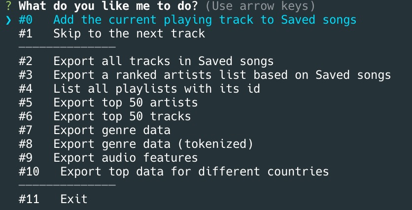

# SpotifyLens

##### NB
So far the core functions I designed have all been implemented. 
The last function I added is to export top data for different countries. And I have also initiated a sister project [`Spotioid`](https://github.com/jzyxyz/Spotioid) to visualize these data, check it out if you are interested.   

Issues may occure if the playlist is extremely large due to API call frequency restrictions by Spofity (over 1.5k, as I am doing concurrent requests, and in that case it will be too many). I will fix this problem later(but not recently). But you can checkout the code in `Worker case 10` where there is a solution for a similar problem.
If you found out any other bugs, please report on [Github](https://github.com/jzyxyz/SpotifyLens). PR is all welcomed. 


This is a **enhanced** wrapper for Spotify-api. It provides a simple api to the data that otherwise have to be computed.

Along with the package also comes a interactive terminal interface with which these data can be exported to local `.json` file. In addition, some handy playback controls are integrated.

## Features

- **Interactive REPL** terminal interface for controling over spotify and export data.

- **Automatically** refreshes access token in the interactive mode. 
- Get **contatenated** & **pruned** (configurable) data of **all** (Say goodbye to 50 objects at a time!) tracks in **ANY** playlists. Concurrent requests garantees the execution is still fast even when the playlist is long .
- Get a list of **ranked** artists from **ANY** playlist. 
- Genre analyzation for **ANY** playlist.
- **Playlist-oriented** audio features analysis.

## How to

### Run interactively at the terminal

  - Create a `.env` file containing these fields.  
    As for how to get secret and id, refer to the docs by Spotify.
  ```
  ClientID=YOUR ID HERE
  ClientSecret=YOUR SECRET HERE
  Port=3000
  OutputDir=data
  Tracks=tracks
  Artists=artists 
  Genres=genres
  AudioFeatures=audio_features
  ```  
  - Clone the repository then `npm install`  *OR* `npm i spotify-lens`.
  - `node run.js` and follow the instrcutions on the terminal. 

### Just use the core api
   
  - `npm i spotify-lens` 
  - Manage the authentication yourself and pass an **authenticated** `SpotifyWebApiNode` instance to the `SpotifyLens` constructor.

  ```javascript
  const { SpotifyLens } = require('spotify-lens')

  //...
  // authenticate with worker/spotify-web-api-node and pass an instance
  const lens = new SpotifyLens(spotifyApi)
  const artistsList = await lens.analyzeGenre()
  //...

  ```

## API

### Worker

The `Worker` class provides authentication flow and cli.

### SpotifyLens

The `SpotifyLens` class provides core functions, and is well-suited to be embeded into exsiting web services. It depends on `lodash`, `spotify-web-api-node`. 

#### Available methods


- Since the core is an enhanced version of `spotify-web-api-node`, any methods from `spotify-web-api-node` are still valid! To call them, just prefix it with `.spotifyApi`. 
- `getAllTracks(playlistId)` returns all tracks found in the playlist with `playlistId`.
- `analyzeGenre(playlistId)` examines the artists in the playlist wtih `playlistId` and return a counted genre representation.
```json
[
  //...
   {
        "count": 82,
        "name": "tropical house"
    },
    {
        "count": 60,
        "name": "dance pop"
    },
    //...
]
```
- `analyzeGenreTokenized(playlistId)` is similar to `analyzeGenre` but will tokenize `tropical house` to `tropical` and `house`.
- `getAllArtists(playlistId)` returns a ranked artists list whose works are found in the playlist with `playlistId`. The artists are ranked by the number of works included in the playlist. So with this api you can analyze for example who are your favorite artists.
- `analyzeAudioFeatures(playlistId)` returns an overall average of features: `'danceability','energy','key','loudness','mode','speechiness','acousticness','instrumentalness','liveness','valence','tempo'`.
```json
{
    "danceability": 0.6460605819748739,
    "energy": 0.7151449681068482,
    "key": 6.833670195008889,
    "loudness": -6.782919252678676,
    "mode": 0.16876905772482756,
    "speechiness": 0.04087642070605159,
    "acousticness": 0.03041756089694307,
    "instrumentalness": 0.0022137601251104467,
    "liveness": 0.21600389719016522,
    "valence": 0.44158085756109505,
    "tempo": 128.1000903658005
}
```
  
  For the methods above, if `playlistId` is `undefined`, it will target at the _Saved Songs_ library.

- `addCurrent` adds the currently being played track to the _Saved Songs_ library.
- `showPlaylists` returns all playlists and the corresponding id.
- `getTopArtists({ time_range, limit, offset })` returns the spotify personalization information about top artistis. Same logic applies to `getTopTracks({ time_range, limit, offset })`
  **NB**
  This is **different** from the default beheavior as specified by Spotfiy documentation. According to documentation from Spotify, the `time_range` is set to `mid_term` as default value. However, this function return data in **all** three time ranges. The returned value look like this:
```json
{
  "long_term": [
    {
      //...
      "genres": [],
      "id": "4KXp3xtaz1wWXnu5u34eVX",
      "images": [],
      "popularity": 62,
      "type": "artist"
    }
    // ...
  ],
  "mid_term": [
    {
      //...
    }
  ],
  "short_term": [
    {
      //...
    }
  ]
}
```
- **DEPRECATED** `nextTrack` lets the playback skip the current track to the next one. Use `skipToNext()` from `spotify-web-api-node` instead. 


## Configure

In the `config.js`, you can configure some beheavior of the api.

- `PRUNE_***_KEYS` contains the keys to be deleted when a `***` object is fetched from spotify api.
- `SPOTIFY_SCOPES` contains the scopes required for Spotify API.
- `PROMPT` contains the cli.

## Roadmap

- [x] Customize keys to export on objects.
- [x] Top artists/tracks.
- [x] Genre data.
- [ ] Reorgnize code to be more maintainable.
- [x] Playlist audio features analysis.
- [ ] Rewrite the project in Typescript.
